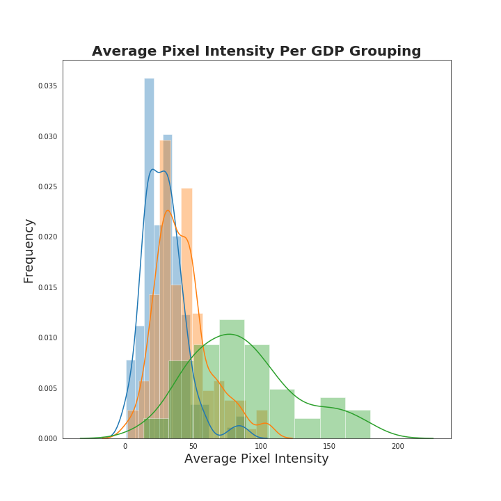

## Predicting GDP for CBSA Regions Using Nighttime Satellite Images 

### Question 
NOAA, the National Oceanic and Atmospheric Administration, has been capturing images of the earth since 2012. I stumbled upon their website a few weeks ago and started to browse. I discovered that NOAA has created a webpage with nighttime satellite image tiff files that the public is free to download and use. I started thinking about how these images could be used for machine learning and what the applications of such a project would be. Nighttime images display lights from different cities and regions across the world... those images are technically 2d arrays with pixel values ranging from 0 to 255 on greyscale... I realized I could use these images to make predictions about the United States! Can satellite images be used to predict the GDP of CBSA regions in the United States? I aim to create multiple machine learning models that attempt to answer that question and choose the best one. 

### Data
#### Google Earth Engine -- Features 
Google Earth Engine offers an API that allows developers to use Google Earth to "detect changes, map trends, and quantify differences on the Earth's surface". I created a Javascript script that interacts with the Earth Engine API and downloads average nighttime images of 133 CBSA regions in the United States for the years 2015-2017, resulting in 399 total tiff images. I saved the images locally, uploaded in a script using glob, cropped them around their centroid into 38x38 pixel images, flattened the 2d image arrays into 1d image arrays, and put them into a Pandas DataFrame with each pixel as a feature. 

  

#### Bureau of Economic Analysis -- Targets
The Bureau of Economic Analysis has GDP numbers for all CBSA regions in the United States for the years 2011-2019. I downloaded a CSV file of the metrics from the BEA website, uploaded the file to a Pandas DataFrame, and used those values as my targets.

### EDA
It is difficult to do helpful and easily digestible data exploration having pixels as my features, but I found trends that confirmed my belief that there is a relationship between the images and their respective GDPs. 

Bucketing GDP values into small, medium, and large buckets (1/3 of the data for each bucket), finding the average pixel values for those buckets, and plotting them on a histogram shows strong evidence that there is a relational signal in this data. 

  

#### Log y Transformation 
For a regression problem, I always take the natural logarithm of my targets, and see if taking the logarithm helps retrieve a linear model. As seen below, the relationship between the CBSAs and GDP is an exponential relationship, so taking the logartihm of GDP transforms the relationship to a negative linear relationship. 

 

### PCA 
Realizing that my features as pixels were hard to interpret, I decided to do Principal Component Analysis on my analysis. PCA uses orthogonal transformation to turn correlated non-linear variables into uncorrelated linear variables and is used for feature reduction in machine learning. I standardized both my train and test features using a StandardScaler and fit them on a PCA model. Once I fit them on a PCA model, I created a Scree chart to find the number of Principal Components that described 90% of the variance in my data.

  

#### First Two Components
The algorithm I used to calculate the number of Principal Components that described 90% of the variance of my data returned 59 Principal Components as features. This can be seen on the Scree plot above. I created a scatterplot of the first two PCs and colored in the data points with their respective GDP sizes (small, medium and large). As seen in the chart below, just the first two PCs begin to show a linear relationship and the GDP sizes are beginning to separate indicating a signal in the data. 

  

### Modeling

#### Linear Regression 
Linear regression is always a good start for regression prediction, because the results are interpretable and there is minimal hyperparameter tuning involved. I used sklearns Linear Regression and Lasso Regression to do my linear modeling, and used a cross validation function that myself. 

##### Lasso with PCA Components 
To begin my modeling, I used a Lasso Regression model and used 61 Principal Components as my features (which described 90% of the variation in my data). I used cross validation to find the optimal alpha value for my model and then trained my data. I ended up with a training r2 score of 98% and a test r2 score of 18%... obvious overfitting. With these results, I realized that my model was trying to descibe noise in the data and not the underlying relationship of the features and the target. Knowing that the first Principal Component of my data described >30% of the variation in my data, I decided to use a smaller amount of Principal Components for next model. For the next model, I tested out models with Principal Components of 15, 10, and 5. Five principal components was the winner! Below are the training and testing R2 and root mean squared error values for my final Lasso Regression model. 

Lasso with PCA | Train | Test
--- | --- | --- 
R2 | 0.5 |  0.33
RMSE | $153,302 | $96,418

##### Lasso with Engineered Features 
PCA is great for dimensionality reduction, but I decided to engineer features for my model and take out the PCA features to see how my engineered features would describe the variance of the data. Below are the results of my feature engineered Lasso model: 

Lasso with Feature Engineering | Train | Test
--- | --- | --- 
R2 | 0.49 |  0.34
RMSE | $153,667 | $95,918

The results are very similar!

#### Random Forest 
For my Random Forest modeling, I could not use GridSearch so tuning the hyperparameters of the data was very difficult. I hypertuned three parameters manually: n_estimators, max_depth, and max_features. I found that n_estimators=300, max_depth=100, max_features=5. Again, I tested out the models with Principal Components of 15, 10, 5, and 5 returned me the best model. However, with PC=5, the data was very overfit and returned a much higher train R2 than the test R2. I will continue working with the Random Forest model to understand why this model is underfitting in the future. Below are the results: 

Random Forest | Train | Test
--- | --- | --- 
R2 | 0.89 |  0.22
RMSE | $70,589 | $104,158

### Conclusions 
#### Problems with the data 
* The dataset only has 400 pictures which is not enough data; can lead to overfitting and unbalanced dataset
* Further investigation into my cross validation function 
* The images do not contain the full CBSA area which can make some smaller CBSA areas seem larger than they are

#### Next Steps and Results
* The models are able to predict within 100 billion dollars of GDP on a scale of trillions of dollars
* Automate the Earth Engine process to get a larger dataset of images 
* Create a Convolutional Neural Net for image prediction 
